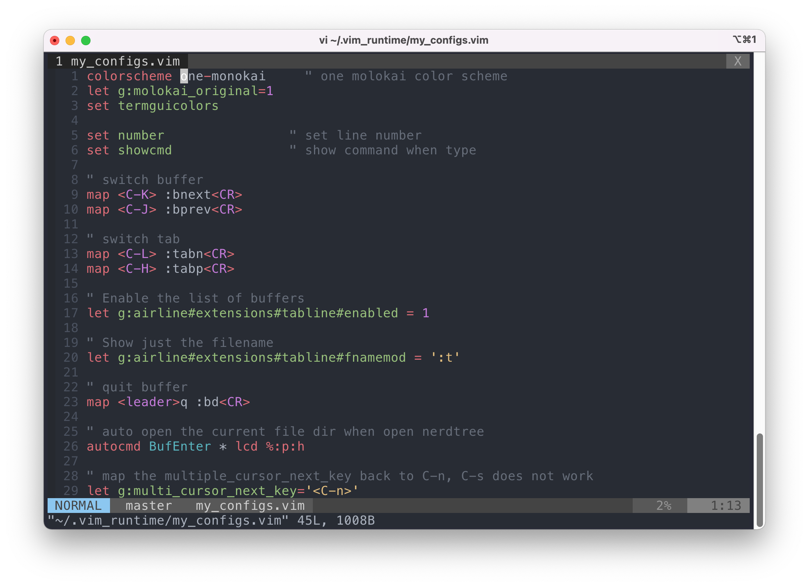

# [Amix](https://github.com/amix/vimrc) Vim Config + [fratajczak One Monokai Theme](https://github.com/fratajczak/one-monokai-vim)



## One Liner Installation

```sh
git clone --depth=1 https://github.com/amix/vimrc.git ~/.vim_runtime
sh ~/.vim_runtime/install_awesome_vimrc.sh
git clone https://github.com/fratajczak/one-monokai-vim ~/.vim_runtime/my_plugins/one-monokai
curl -o ~/.vim_runtime/my_configs.vim https://raw.githubusercontent.com/shrekuu/vimrc/main/my_configs.vim
```

## Manual Installation

1. First, clone config from [amix's vimrc  repo](https://github.com/amix/vimrc) (😅😅😅)

  ```bash
  git clone --depth=1 https://github.com/amix/vimrc.git ~/.vim_runtime
  sh ~/.vim_runtime/install_awesome_vimrc.sh
  ```

2. Add `one-monokai` theme

  ```sh
  git clone https://github.com/fratajczak/one-monokai-vim ~/.vim_runtime/my_plugins/one-monokai
  ```

3. Create `my_configs.vim`

  ```sh
  touch ~/.vim_runtime/my_configs.vim
  ````

4. Copy and paste my configs into it.

  ```vim
  colorscheme one-monokai     " one molokai color scheme
  let g:molokai_original=1
  set termguicolors

  set number                " set line number
  set showcmd               " show command when type

  " switch buffer
  map <C-K> :bnext<CR>
  map <C-J> :bprev<CR>

  " switch tab
  map <C-L> :tabn<CR>
  map <C-H> :tabp<CR>

  " Enable the list of buffers
  let g:airline#extensions#tabline#enabled = 1

  " Show just the filename
  let g:airline#extensions#tabline#fnamemod = ':t'

  " quit buffer
  map <leader>q :bd<CR>

  " auto open the current file dir when open nerdtree
  autocmd BufEnter * lcd %:p:h

  " map the multiple_cursor_next_key back to C-n, C-s does not work
  let g:multi_cursor_next_key='<C-n>'

  " airline font fix
  " let airline_left_sep=''
  " let airline_right_sep=''

  " remove highlighting search result quickly
  map <leader>h :set hlsearch!<cr>

  " share system clipboard
  set clipboard=unnamed

  " disable folding
  set nofoldenable

  " add syntax highlight for *.conf files
  :autocmd BufRead,BufNewFile logging.conf setf dosini

  ```

## References

- https://github.com/amix/vimrc
- https://github.com/fratajczak/one-monokai-vim
